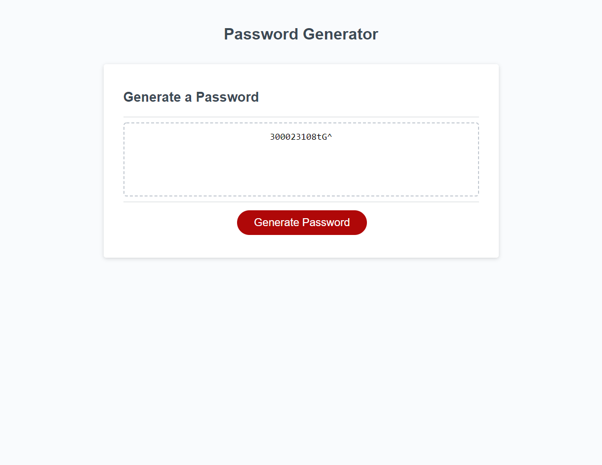

## Is-This-Your-Password
This would be a simple random password generator utilizing basic JavaScript.

## Challenges
This challenge focused on generating a random password using numbers, lowercase, uppercase and special characters. When choosing generate password button, you are followed up with a number of prompt's and criteria that the password will return with. When selections are made, a random password will be displayed in the text area.
I do realize the numbers are included regardless of selection. Edits may soon be coming.

## Links
https://tyler-wenerstrom.github.io/Is-This-Your-Password/

## Author
https://github.com/Tyler-Wenerstrom